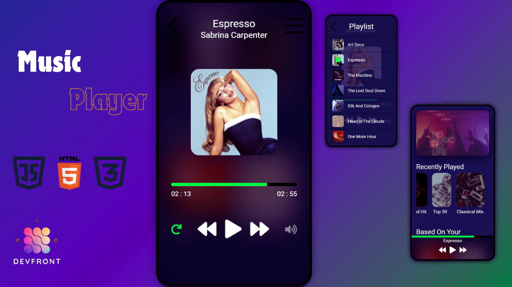

# MusicPlayer_JavaScript

A simple, elegant desktop music player built using HTML, CSS, and JavaScript. This project is designed to provide an engaging music listening experience with features like play, pause, next, and previous track controls, along with a visual display of the current track information.

## Table of Contents

- [Overview](#overview)
- [Features](#features)
- [Technologies Used](#technologies-used)
- [Getting Started](#getting-started)
- [Usage](#usage)
- [Project Structure](#project-structure)
- [Screenshots](#screenshots)

## Overview

The Music Player offers a user-friendly interface for listening to your favorite tracks on a desktop. It includes essential playback controls, a carousel to showcase recently played tracks, and a playlist management section to organize your music queue. Note that this player is specifically designed for desktop use and is not responsive to mobile devices.

## Features

- **Play, Pause, Next, and Previous Track Controls**: Easily navigate through your music library with intuitive controls.
- **Current Track Information**: Displays the current song's name, artist, and album cover.
- **Recently Played Carousel**: A dynamic carousel showcasing your recently played tracks for easy access.
- **Playlist Management**: A dedicated playlist section to manage your music queue effectively.
- **Volume Control**: Adjust the volume using a slider for precise control.
- **Seek Bar**: Navigate through the current track with a seek bar.
- **Repeat Function**: Option to repeat the current track for continuous listening.

## Technologies Used

- **HTML**: Provides the structure for the music player.
- **CSS**: Styles the player, ensuring a visually appealing and cohesive interface.
- **JavaScript**: Adds functionality to the music player, including playback controls, playlist management, and dynamic updates.

## Getting Started

### Prerequisites

To run this project locally, you need a web browser and a collection of music files to use with the player.

### Installation

1. **Clone the Repository:**

   ```bash
   git clone https://github.com/MahnoorIshtiaq/MusicPlayer_JavaScript.git
   ```

2. **Navigate to the Project Directory:**

   ```bash
   cd MusicPlayer_JavaScript
   ```

3. **Open `index.html`:**

   Double-click the `index.html` file to open it in your default web browser, or use a local server if you prefer.

## Usage

- **Loading Music Files:**
  Add your music files to the designated folder in the project directory.

- **Playback Controls:**
  Use the play, pause, next, and previous buttons to control the playback of your music.

- **Managing Your Playlist:**
  Drag and drop tracks into the playlist section to manage your music queue.

- **Volume and Seek Bar:**
  Adjust the volume and navigate through the track using the provided controls.

## Project Structure

Here's a brief overview of the project structure:

```bash
MusicPlayer_JavaScript/
│
├── index.html         # The main HTML file
├── style.css          # The CSS file for styling
└── script.js          # The JavaScript file for functionality
```

## Screenshots




